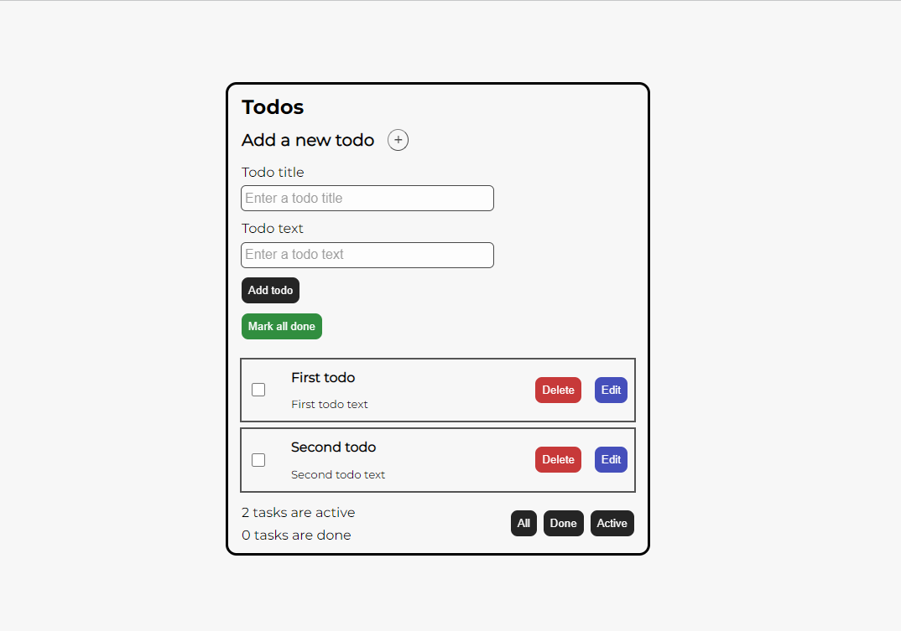

# Todo App

## О проекте

Простое Todo приложение, созданное для демонстрации функциональных возможностей кастомной библиотеки стейт-менеджера **zuxs**. [Репозиторий библиотеки zuxs](https://github.com/MonkeyBoy248/zuxs)

## Как развернуть проект

1. Загрузите папку с проектом.

2. Разархивируйте папку с проектом и перейдите в нее.
3. В терминале введите команду `npm i`
4. После окончания установки всех зависимостей используйте команду `npm run dev`.
5. Проект откроется в браузере по адресу **http://localhost:5000/**.

